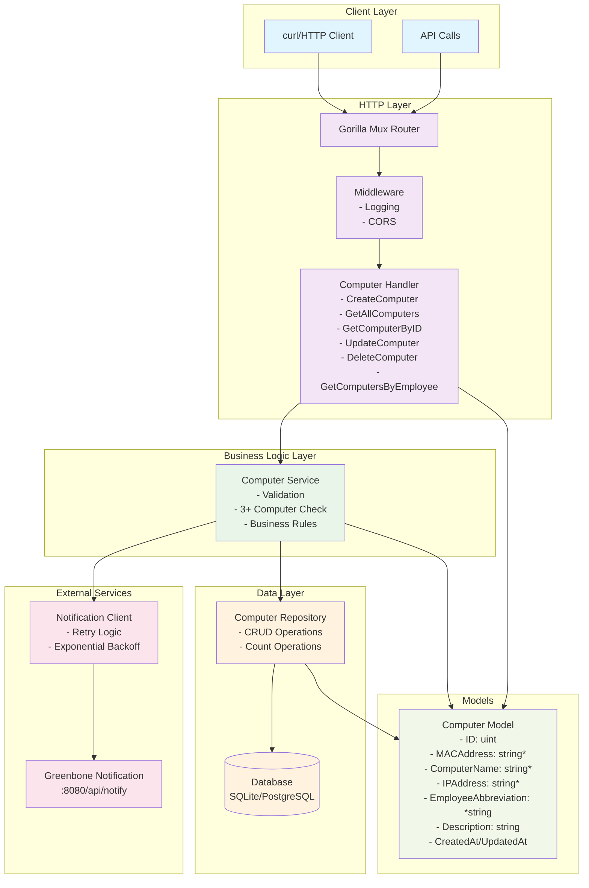

# Computer Management API

A REST API for managing company computers built with Go, GORM, and PostgreSQL/SQLite. Integrates with Greenbone notification service.

## Overview

This API allows system administrators to track company-issued computers, assign them to employees, and receive notifications via the Greenbone notification service when an employee has 3 or more computers assigned.

## Architecture Diagram



## Quick Start

### Docker Setup (Recommended)
```bash
# Clean up any existing containers
docker-compose down --volumes

# Start all services
docker-compose up --build
```

### Local Development
```bash
# Clone and setup
git clone <repository-url>
cd computer-management-api
go mod tidy

# Set environment variables to point to Greenbone service
export NOTIFICATION_URL=http://localhost:8080
export PORT=8081
export DB_TYPE=sqlite
export DATABASE_URL=computers.db

# Run API (Greenbone service should be running on port 8080)
go run cmd/api/main.go
```

## Greenbone Integration

This API works with `exercise-admin-notification`(https://github.com/greenbone/exercise-admin-notification) service:

```bash
docker pull greenbone/exercise-admin-notification
docker run -p 8080:8080 greenbone/exercise-admin-notification
```

## API Endpoints

POST  `/api/computers` - Create a new computer
GET `/api/computers` - Get all computers
GET `/api/computers/{id}` - Get computer by ID
PUT `/api/computers/{id}` - Update computer
DELETE `/api/computers/{id}` - Delete computer
GET `/api/employees/{abbr}/computers` - Get computers by employee
GET `/api/health` | Health check |

## How to use it

### Create Computer
```bash
curl -X POST http://localhost:8081/api/computers \
  -H "Content-Type: application/json" \
  -d '{
    "mac_address": "00:11:22:33:44:55",
    "computer_name": "MacBook Pro 2023",
    "ip_address": "192.168.1.100",
    "employee_abbreviation": "mmu",
    "description": "Development laptop"
  }'
```

### Test Notification
```bash
# Create 3 computers for employee "mmu" to trigger the notification
for i in {1..3}; do
  curl -X POST http://localhost:8081/api/computers \
    -H "Content-Type: application/json" \
    -d "{
      \"mac_address\": \"00:11:22:33:44:0$i\",
      \"computer_name\": \"Computer $i\",
      \"ip_address\": \"192.168.1.$i\",
      \"employee_abbreviation\": \"mmu\",
      \"description\": \"Test computer $i\"
    }"
  echo "Created computer $i"
  sleep 1
done
```

## Notification System

When an employee is assigned 3+ computers, the system sends a notification to the notification service:

**Format:**
```json
{
  "level": "warning",
  "employeeAbbreviation": "mmu",
  "message": "Employee mmu has been assigned 3 computers"
}
```

## Configuration

### Environment Variables

`DB_TYPE` - Database type (sqlite/postgres) `sqlite`
`DATABASE_URL` - Database connection string `computers.db`
`NOTIFICATION_URL` - Greenbone notification service URL `http://localhost:8080`
`PORT` - API server port `8081`

## Testing

```bash
# Run all tests
go test ./...

# Run with coverage
go test -cover ./...

# Test specific package
go test ./pkg/services/
```

## Project Structure

```
├── cmd/
│   └── api/main.go          # Main API server
├── pkg/
│   ├── handlers/            # HTTP handlers
│   ├── services/            # Business logic
│   ├── models/              # Data models & repository
│   └── notifications/       # Notification client
├── internal/db/             # Database setup
├── docker-compose.yml       # Docker services
└── Dockerfile              # Container build
```