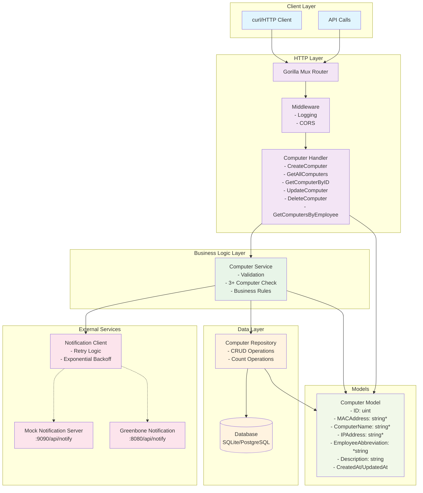
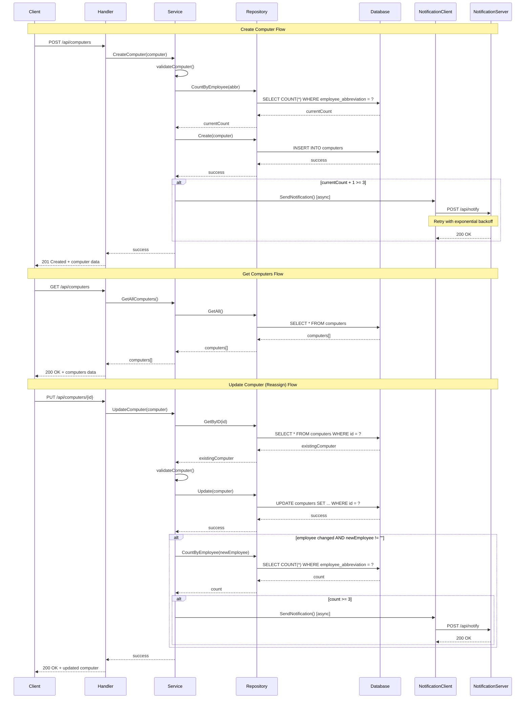

# Computer Management API

A REST API for managing company-issued computers built with Go, GORM, and PostgreSQL/SQLite.

## Overview

This API allows system administrators to track company-issued computers, assign them to employees, and receive notifications when an employee has 3 or more computers assigned.

## Architecture Diagram



## API Flow Diagram



## Quick Start

### Local Development
```bash
# Clone and setup
git clone <repository-url>
cd computer-management-api
go mod tidy

# Run with SQLite (default)
go run cmd/api/main.go

# Run mock notification server (separate terminal)
go run cmd/mock-notify/main.go
```

### Docker Setup
```bash
docker-compose up --build
```

## API Endpoints

| Method | Endpoint | Description |
|--------|----------|-------------|
| POST | `/api/computers` | Create a new computer |
| GET | `/api/computers` | Get all computers |
| GET | `/api/computers/{id}` | Get computer by ID |
| PUT | `/api/computers/{id}` | Update computer |
| DELETE | `/api/computers/{id}` | Delete computer |
| GET | `/api/employees/{abbr}/computers` | Get computers by employee |
| GET | `/api/health` | Health check |

## Usage Examples

### Create Computer
```bash
curl -X POST http://localhost:8080/api/computers \
  -H "Content-Type: application/json" \
  -d '{
    "mac_address": "00:11:22:33:44:55",
    "computer_name": "MacBook Pro 2023",
    "ip_address": "192.168.1.100",
    "employee_abbreviation": "mmu",
    "description": "Development laptop"
  }'
```

### Get All Computers
```bash
curl http://localhost:8080/api/computers
```

### Test 3-Computer Notification
```bash
# Create 3 computers for employee "mmu" to trigger notification
for i in {1..3}; do
  curl -X POST http://localhost:8080/api/computers \
    -H "Content-Type: application/json" \
    -d "{
      \"mac_address\": \"00:11:22:33:44:0$i\",
      \"computer_name\": \"Computer $i\",
      \"ip_address\": \"192.168.1.$i\",
      \"employee_abbreviation\": \"mmu\",
      \"description\": \"Test computer $i\"
    }"
done
```

## Data Model

**Computer:**
- MAC Address (required, 17 chars, unique)
- Computer Name (required, max 100 chars)
- IP Address (required, max 15 chars)
- Employee Abbreviation (optional, exactly 3 lowercase letters)
- Description (optional, max 500 chars)

## Notification System

When an employee is assigned 3+ computers, the system sends a notification:

```json
{
  "level": "warning",
  "employeeAbbreviation": "mmu",
  "message": "Employee mmu has been assigned 3 computers"
}
```

Features:
- Automatic triggering on 3+ computer assignment
- Retry logic with exponential backoff
- Mock notification server included for testing

## Configuration

| Environment Variable | Description | Default |
|---------------------|-------------|---------|
| `DB_TYPE` | Database type (sqlite/postgres) | `sqlite` |
| `DATABASE_URL` | Database connection string | `computers.db` |
| `NOTIFICATION_URL` | Notification service URL | `http://localhost:9090` |
| `PORT` | Server port | `8080` |
(
➜  export DB_TYPE=sqlite
➜  export DATABASE_URL=computers.db
➜  export NOTIFICATION_URL=http://localhost:9090
➜  export PORT=8080
)

## Testing

```bash
# Run all tests
go test ./...

# Run with coverage
go test -cover ./...

# Test specific package
go test ./pkg/services/
```

## Project Structure

```
├── cmd/
│   ├── api/main.go          # Main API server
│   └── mock-notify/main.go  # Mock notification server
├── pkg/
│   ├── handlers/            # HTTP handlers
│   ├── services/            # Business logic
│   ├── models/              # Data models & repository
│   └── notifications/       # Notification client
├── internal/db/             # Database setup
├── docker-compose.yml       # Docker services
└── Dockerfile              # Container build
```